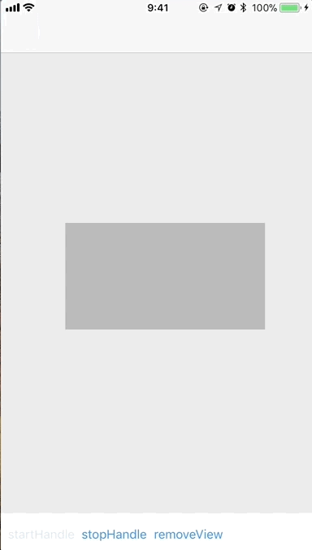

[](https://travis-ci.org/darquro/ViewableHandler)
[](http://cocoapods.org/pods/ViewableHandler)
[](http://cocoapods.org/pods/ViewableHandler)
[](http://cocoapods.org/pods/ViewableHandler)

Handle a view visibility in the window



## Usage

```swift
// start handling visibility
targetView.visibility
    .changed { state in
        switch state {
        case .visible:
            // visible process here
        case .invisible:
            // invisible process here
    }
}

// stop handling visibility
targetView.visibility.invalidate()
```

## Configuration

You can change the configuration with `setConfig`

```swift
targetView.visibility
    .setConfig { config in
        config.timeInterval = 1.0
        config.intersectionRatio = 0.8
        config.transparencyRatio = 0.5
    }
    .changed { state in
        ...
    }
```

|name|description|default|
|----|----|----|
|timeInterval|Interval time of checking view state (sec)|0.5|
|intersectionRatio|The view rectangle visible ratio in UIWindow (0<..1.0)|0.5|
|transparencyRatio|The view transparency ratio (0..<1.0)|0|

## Installation

Visibility is available through [CocoaPods](http://cocoapods.org). To install
it, simply add the following line to your Podfile:

```ruby
pod "Visibility"
```

## Requirements

- Swift 4.0 or later
- iOS 8.0 or later

## Author

darquro

## License

VerticalAlignmentLabel is available under the MIT license. See the LICENSE file for more info.